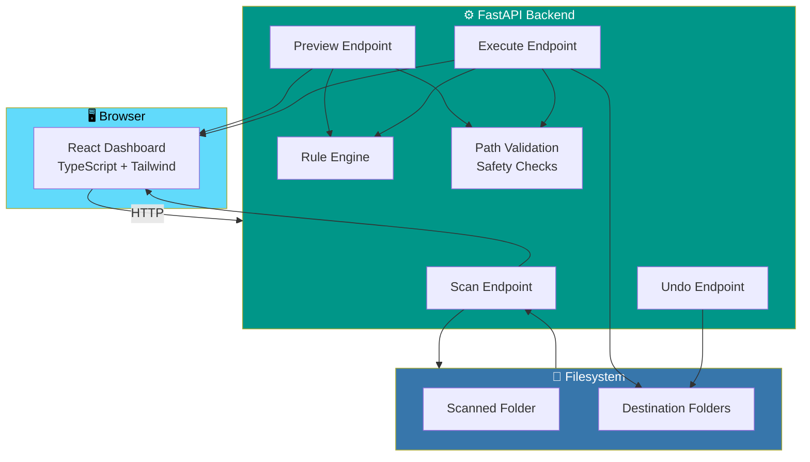

# 📁 File Organizer

<div align="center">


**A desktop-style file organization utility.**

*Python does the real filesystem work. React shows you exactly what will move where — before anything touches disk.*

[✨ How It Works](#-how-it-works) • [🚀 Quick Start](#-quick-start) • [🔐 Safety](#-safety) • [🏗️ Architecture](#-architecture) • [🛠️ Tech Stack](#-tech-stack)

</div>

---

## 📖 Overview

**File Organizer** scans a folder, shows you exactly what will move where, and only touches disk once you confirm.

- **Python backend** — does the real filesystem work, safely and transparently
- **React dashboard** — a clean UI on top, so you always see the plan before it runs

### Core Idea

> **Preview and execute are separate operations by design.**
>
> Nothing is written to disk until you say so. And when you do, you can undo it with one click.

---

## 🚀 Quick Start

**Two terminals** — the backend needs to be running for the frontend to do anything.

### Terminal 1 — Backend

```bash
cd backend
python -m venv .venv
source .venv/bin/activate        # Windows: .venv\Scripts\activate
pip install -r requirements.txt
uvicorn app.main:app --reload --port 8000
```

### Terminal 2 — Frontend

```bash
cd frontend
npm install
npm run dev
```

### Use It

1. Open **`http://localhost:5173`**
2. Paste in a folder path — e.g. `/Users/you/Downloads`
3. Hit **Scan**

> 📚 **Full setup, production build, and API details** are in each folder's own README:
> [`backend/README.md`](backend/README.md) · [`frontend/README.md`](frontend/README.md)

---

## ⚙️ How It Works


### Step 1 — Scan

Point it at a folder. The backend reports:

- File counts
- Total size
- Breakdown by type

### Step 2 — Choose a Mode

| Mode | What It Does |
|------|--------------|
| **By Type** | Groups files by extension — images, documents, videos, etc. |
| **By Date** | Groups by **modified** or **created** date |
| **Custom Rules** | Write your own rules — your folder, your logic |

Plus **how to handle name collisions:**

- **Rename** — auto-suffix to avoid collisions
- **Skip** — leave the existing file alone
- **Ask** — decide case by case
- **Replace** — with explicit confirmation

### Step 3 — Preview

**Every proposed move is listed before anything happens.**

> 🔒 **Nothing is written to disk at this stage.**

### Step 4 — Organize

Confirm, and the backend executes the plan and reports **real statistics**:

- Files organized
- Folders created
- Space processed
- Skipped
- Duplicates
- Time taken
- Any failures

### Step 5 — Undo

**One click reverses the moves from the run you just did.**

---

## 🔐 Safety

Safety isn't a feature here — it's the foundation.

| Guarantee | How It's Enforced |
|-----------|------------------|
| **Never deleted, modified, or executed** | Files are **only ever moved** |
| **No silent overwrite** | A destination that already has a same-named file is **never silently overwritten** |
| **No path traversal** | Every path is validated before use |
| **No system directories** | Operating on system directories is blocked |
| **No symlink escapes** | Symlinks pointing out of the scanned tree are not followed |
| **Preview ≠ Execute** | They are **separate API calls by design** |

> 📖 **See [`backend/README.md`](backend/README.md)** for the full breakdown of what's enforced where.

---

## 🏗️ Architecture

```
file-organizer/
├── backend/     FastAPI service — scanning, organizing, undo, rules
└── frontend/    React + TypeScript + Tailwind dashboard
```

### System Diagram



### Design Principles

- **Preview and execute are separate endpoints** — you can never accidentally run a plan
- **Rules are declarative** — the frontend builds them, the backend validates and executes
- **Path validation happens on every operation** — no exceptions
- **Undo stores the exact move log** — reversal is precise, not heuristic

---

## 🛠️ Tech Stack

### Backend

| Library | Purpose |
|---------|---------|
| **Python** | Language |
| **FastAPI** | HTTP framework |
| **pathlib / os / shutil** | Filesystem operations |
| **Pydantic** | Request and response validation |
| **No database** | State is kept in-memory for the session |

### Frontend

| Library | Purpose |
|---------|---------|
| **React** | UI framework |
| **TypeScript** | Type safety |
| **Tailwind CSS** | Styling |
| **Vite** | Build tool |

---

## 🗺️ Roadmap

### ✅ Current

- [x] Folder scanning with file counts, size, and type breakdown
- [x] Three organization modes: By Type, By Date, Custom Rules
- [x] Four collision strategies: Rename, Skip, Ask, Replace
- [x] Full preview before execution
- [x] Real execution statistics (files, folders, size, skipped, duplicates, time, failures)
- [x] One-click undo of the last run
- [x] Path validation and safety checks
- [x] No database — state is in-memory

### 🔜 Future Ideas

- [ ] Saved rule presets
- [ ] Scheduled / recurring organization
- [ ] Multi-folder batch operations
- [ ] Dry-run report export (CSV / PDF)
- [ ] Duplicate detection with content hashing
- [ ] Custom folder structure templates
- [ ] Undo history across multiple runs
- [ ] Desktop app wrapper (Tauri / Electron)

---

## 🤝 Contributing

Contributions are welcome. Please:

1. Fork the repository
2. **Preserve the preview/execute separation** — never combine them
3. **Validate every path** — no exceptions, no shortcuts
4. **Never delete or modify files** — only move
5. Add tests for any new safety rule
6. Submit a Pull Request

### Guidelines

- **Never overwrite silently** — a collision always needs a decision
- **Never follow symlinks** out of the scanned tree
- **Never trust a path from the client** — re-validate server-side
- **Never execute a plan without a fresh preview** — the plan must match what the user saw

---

## 📜 License

MIT — see [LICENSE](LICENSE) for details.

---

## 🙏 Acknowledgments

- **FastAPI** — for making a Python backend feel modern
- **pathlib** — for making filesystem work readable
- **Every downloads folder that's ever gotten out of hand** — this is for you

---

<div align="center">

### 📁 SCAN. PREVIEW. ORGANIZE. UNDO.

**Nothing touches disk until you say so.**

**Files are only ever moved — never deleted, never modified, never executed.**

<br>

⭐ If this project helped you, consider giving it a star.

<br>

[⬆ Back to Top](#-file-organizer)

</div>
